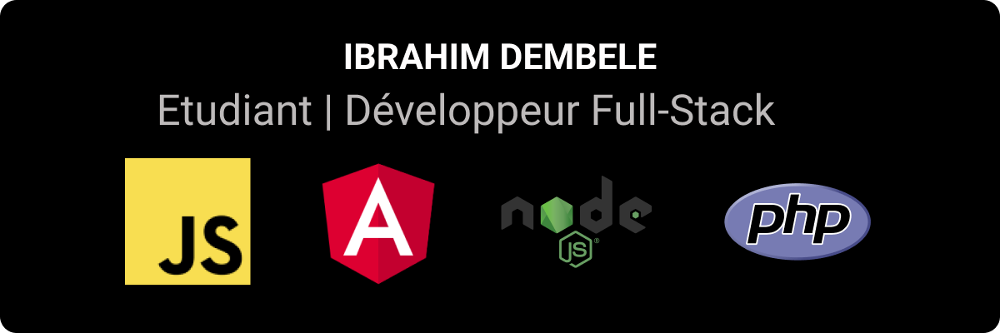

### 👲🏿 About
- I completed an internship from July to August 2021, where I worked with React and Node.js.  
- Finished a 2-year apprenticeship at **SII Sud-Ouest** (July 2023 — September 26, 2025).  
- Currently deepening my expertise in **Advanced Angular**, **React** and **Node.js** with **TypeScript**, with a focus on **Playwright E2E testing**.
- Next on my roadmap: mastering **Advanced Docker**.

### 🏅 Certifications
- **October 12, 2025** — Certified [**Junior Angular**](https://certificates.dev/angular/certificates/a0192c6f-6850-4bf5-958f-0fe137447118) Developer From [Certificates.dev](https://certificates.dev/)

### 📬 contact me !

<a href="https://www.linkedin.com/in/ibrahim-dembele-2a91351b3/">
  
</a>
 📩 : <a href="mailto:ibrahimk.dembele@outlook.fr" target="_blank">ibrahimk.dembele@outlook.fr</a>

### Tools & Spoken Languages :

 
 
 
 
 
 
 
 
 
 
 
 
 
 
 
 
 
 
 
 
 
 
 
 
 
 
 
 
<br/>
<br/>

### Github Stats

<p align="center">
</p>

<br/>

📊 **This week, I spent my time on:**

<!--START_SECTION:waka-->

```txt
From: 09 October 2025 - To: 16 October 2025

TypeScript         23 hrs 10 mins  █████████████▒░░░░░░░░░░░   53.42 %
HTML               6 hrs 57 mins   ████░░░░░░░░░░░░░░░░░░░░░   16.04 %
JavaScript         5 hrs 36 mins   ███▒░░░░░░░░░░░░░░░░░░░░░   12.92 %
SCSS               4 hrs 18 mins   ██▒░░░░░░░░░░░░░░░░░░░░░░   09.94 %
JSON               1 hr 38 mins    █░░░░░░░░░░░░░░░░░░░░░░░░   03.77 %
```

<!--END_SECTION:waka-->

<br/>

<!---->

<br/>

<p align="center"> </p>
